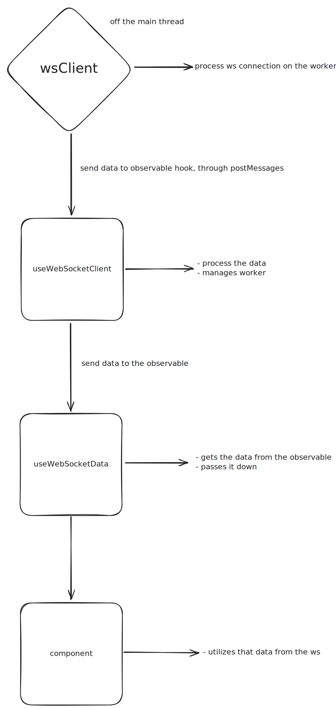

# WS Worker Observable Example

## Overview

This is a TypeScript-based example designed to show how real-time data handling through WebSockets in a React application is made on high frequency apps. It leverages RxJS observables and Web Workers to manage WebSocket connections efficiently, ensuring smooth and responsive user interfaces even when dealing with high-frequency data streams.

## What's Included

- **WebSocket Management**: Simplifies the process of connecting to WebSocket channels and handling incoming data.
- **RxJS Integration**: Utilizes RxJS observables to provide a reactive programming model for WebSocket data.
- **Web Workers**: Offloads WebSocket handling to Web Workers, preventing the main thread from being blocked and improving performance.
- **TypeScript Support**: Fully typed with TypeScript, providing type safety and better developer experience.

## Installation

To install the necessary dependencies, run:

```bash
npm install observable-hooks rxjs comlink
```

## Usage

### Setting Up WebSocket Client

The `WebSocketClient` class manages WebSocket connections, sending messages, and handling incoming data.

```typescript
import { expose } from "comlink";

class WebSocketClient {
  private connections: Map<string, WebSocket> = new Map();
  private reconnectInterval: number = 5000;
  private shouldReconnect: Map<string, boolean> = new Map();

  /**
   * Connects to a WebSocket channel.
   *
   * @param {string} channel - The WebSocket channel to connect to.
   * @param {string} url - The WebSocket server URL.
   */
  connect(channel: string, url: string): void {
    if (this.connections.has(channel)) {
      console.warn(`Already connected to channel: ${channel}`);
      return;
    }

    const ws = new WebSocket(url);

    ws.onmessage = (event: MessageEvent) => {
      // console.log("MESSAGE EVENT", event);

      // Fake heavy calculation
      for (let i = 0; i < 10000000; i += 1) {}

      self.postMessage({ channel, data: event.data });
    };

    ws.onclose = () => {
      this.connections.delete(channel);
      this.reconnect(channel, url);
    };

    ws.onerror = () => {
      this.connections.delete(channel);
      this.reconnect(channel, url);
    };

    this.connections.set(channel, ws);
    this.shouldReconnect.set(channel, true);
  }

  /**
   * Attempts to reconnect to a WebSocket channel after a specified interval.
   *
   * @param {string} channel - The WebSocket channel to reconnect to.
   * @param {string} url - The WebSocket server URL.
   */
  private reconnect(channel: string, url: string): void {
    if (this.shouldReconnect.get(channel)) {
      setTimeout(() => {
        console.log(`Reconnecting to channel: ${channel}`);
        this.connect(channel, url);
      }, this.reconnectInterval);
    }
  }

  /**
   * Disconnects from a WebSocket channel.
   *
   * @param {string} channel - The WebSocket channel to disconnect from.
   */
  disconnect(channel: string): void {
    const ws = this.connections.get(channel);
    if (ws) {
      this.shouldReconnect.set(channel, false);
      ws.close();
      this.connections.delete(channel);
    }
  }

  /**
   * Sends a message to a WebSocket channel.
   *
   * @param {string} channel - The WebSocket channel to send the message to.
   * @param {string} message - The message to send.
   */
  send(channel: string, message: string): void {
    const ws = this.connections.get(channel);
    if (ws && ws.readyState === WebSocket.OPEN) {
      ws.send(message);
    } else {
      console.error(`No open connection for channel: ${channel}`);
    }
  }
}

expose(new WebSocketClient());

export type { WebSocketClient };
```

### Usage

#### Setting Up WebSocket Client

The `WebSocketClient` class manages WebSocket connections, sending messages, and handling incoming data.

#### Creating the WebSocket Hook

The `useWebSocketClient` hook creates an observable for WebSocket data and provides a function to send messages.

```typescript
import { wrap } from "comlink";
import { Observable } from "rxjs";
import type { WebSocketClient } from "../workers/wsClient";

const createWorker = (): Worker | null => {
  if (typeof window !== "undefined") {
    return new Worker(new URL("../workers/wsClient", import.meta.url), {
      type: "module",
    });
  }
  return null;
};

const worker = createWorker();
const wsClient = worker ? wrap<WebSocketClient>(worker) : null;

type MessageEventData = {
  channel: string;
  data: string;
};

const useWebSocketClient = <T>(
  channel: string,
  url: string
): { observable$: Observable<T>; send: (message: string) => void } => {
  if (!wsClient || typeof window === "undefined") {
    return {
      observable$: new Observable<T>(),
      send: () => {
        throw new Error("WebSocket client is not available");
      },
    };
  }

  const observable$ = new Observable<T>((subscriber) => {
    try {
      wsClient.connect(channel, url);
    } catch (error) {
      subscriber.error(`Failed to connect to channel ${channel}: ${error}`);
      return;
    }

    const listener = async (event: MessageEvent) => {
      const { channel: eventChannel, data } = event.data as MessageEventData;
      if (eventChannel === channel) {
        try {
          if (data === "ping frame") {
            wsClient.send(channel, "pong frame");
            return;
          }
          const pData = JSON.parse(data);
          if ("code" in pData) {
            subscriber.error(pData.error);
            return;
          }
          subscriber.next(pData);
        } catch (error) {
          subscriber.error(`Failed to process message: ${error}`);
        }
      }
    };

    worker?.addEventListener("message", listener);

    return () => {
      worker?.removeEventListener("message", listener);
      wsClient.disconnect(channel);
    };
  });

  const send = (message: string) => {
    wsClient.send(channel, message);
  };

  return { observable$, send };
};

export { useWebSocketClient };
```

#### Using the Hook in a React Component

The `useWebSocketData` hook subscribes to the WebSocket observable and provides the latest data.

```typescript
import { useObservableState } from "observable-hooks";
import { useWebSocketClient } from "@/hooks/useWebSocketClient";

const useWebSocketData = <T>(
  channel: string,
  url: string
): { data: T | null; send: (message: string) => void } => {
  const { observable$, send } = useWebSocketClient<T>(channel, url);
  const [data] = useObservableState<T | null>(() => observable$, null);
  return { data, send };
};

export { useWebSocketData };
```

#### Example Component

An example React component that uses the `useWebSocketData` hook to display trade and order book data.

```typescript
"use client";

import React from "react";
import { useWebSocketData } from "@/hooks/useWebSocketData";

type TradeData = {
  e: string;
  E: number;
  s: string;
  t: number;
  p: string;
  q: string;
  T: number;
  m: boolean;
  M: boolean;
};

type OrderBookData = {
  lastUpdateId: number;
  bids: [string, string][];
  asks: [string, string][];
};

const Page = () => {
  const { data: orderBookData } = useWebSocketData<OrderBookData>(
    "order-book",
    "wss://stream.binance.com:9443/ws/btcusdt@depth20"
  );
  const { data: tradeData } = useWebSocketData<TradeData>(
    "trade",
    "wss://stream.binance.com:9443/ws/btcusdt@trade"
  );

  return (
    <div>
      {tradeData ? (
        <pre>{JSON.stringify(tradeData, null, 2)}</pre>
      ) : (
        <p>Waiting for trade data...</p>
      )}

      {orderBookData ? (
        <pre>{JSON.stringify(orderBookData, null, 2)}</pre>
      ) : (
        <p>Waiting for order book data...</p>
      )}
    </div>
  );
};

export default Page;
```

#### Why It's Good

- Performance: By using Web Workers, the library ensures that WebSocket handling does not block the main thread, leading to a more responsive UI.
- Scalability: The use of RxJS observables allows for easy composition and transformation of data streams, making it suitable for complex real-time applications.
- Type Safety: TypeScript provides type safety, reducing the likelihood of runtime errors and improving code maintainability.
- Ease of Use: The hooks abstract away the complexity of WebSocket management, making it easy to integrate real-time data into React components.

#### Note on Web Workers

Web Workers are particularly useful when you need to process data received from WebSockets. They allow you to offload heavy computations to a separate thread, ensuring that the main thread remains responsive. If your application only needs to handle simple WebSocket messages without significant processing, using Web Workers might not be necessary.

#### Diagram



#### Binance API Documentation

The example component utilizes the Binance WebSocket API to fetch real-time trade and order book data. The Binance API provides a variety of WebSocket streams for different types of market data.

For more detailed information, please refer to the official Binance API documentation:

[Binance Spot API Documentation - WebSocket Streams](https://developers.binance.com/docs/binance-spot-api-docs/web-socket-streams)

##### WebSocket Streams Used in the Example

All types were generated getting the data from the WebSocket streams and transforming it into types.

- **Trade Stream**: Provides real-time trade data for a specific symbol.
  - Endpoint: `wss://stream.binance.com:9443/ws/btcusdt@trade/`
- **Order Book Stream**: Provides real-time order book data for a specific symbol.
  - Endpoint: `wss://stream.binance.com:9443/ws/btcusdt@depth20/`
